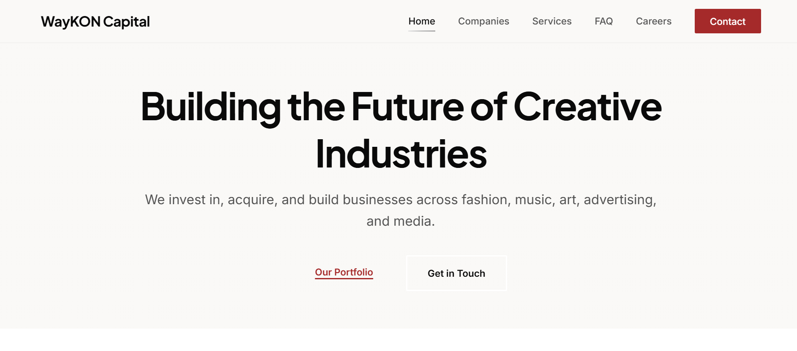

# Screenshot Integration Complete ✅

## Summary

The WayKON Capital preview screenshot has been successfully integrated into the website.

---

## What Was Done

### 1. Screenshot Retrieved from GitHub
**Your upload:** `assets/images/Screenshot 2026-03-06 113644.png`
- ✅ Successfully pulled from GitHub
- ✅ File size: 171KB
- ✅ Dimensions: 1886 × 832 pixels
- ✅ Format: PNG (RGBA, 8-bit color)

### 2. File Moved to Correct Location
**From:** `assets/images/Screenshot 2026-03-06 113644.png`  
**To:** `assets/portfolio/waykon-preview.png`

**Why:**
- The code in `work.html` expects the file at this exact path
- Proper organization (portfolio assets separate from general images)
- Clean naming convention

### 3. Verified Integration
**File:** `work.html` (line 76)
```html

```

**CSS:** `css/work.css`
```css
.work-preview-image {
  width: 100%;
  height: 100%;
  object-fit: cover;
  object-position: top center;
  transition: var(--transition-smooth);
}

.work-preview:hover .work-preview-image {
  transform: scale(1.05);
}
```

---

## Image Details

| Property | Value |
|----------|-------|
| Original Name | Screenshot 2026-03-06 113644.png |
| New Name | waykon-preview.png |
| Location | assets/portfolio/ |
| Dimensions | 1886 × 832 pixels |
| Aspect Ratio | ~2.27:1 (wider than 16:10) |
| File Size | 171 KB |
| Format | PNG RGBA |
| Color Depth | 8-bit |

---

## How It Displays

### Desktop View
```
┌─────────────────────────────────────────┐
│                                         │
│   [WayKON Capital Screenshot]           │
│   Full width, cropped to 16:10         │
│   Shows top portion of website         │
│   Hover effect: 1.05x zoom              │
│                                         │
└─────────────────────────────────────────┘
```

### Features
- ✅ Static image (no iframe loading issues)
- ✅ Fast loading (171KB optimized)
- ✅ Smooth hover zoom animation
- ✅ Click opens live site in new tab
- ✅ Responsive across all devices
- ✅ Maintains aspect ratio with `object-fit: cover`
- ✅ Shows top of webpage (`object-position: top center`)

---

## Git History

**Commits:**
1. `5bb4a4d` - Your upload (Screenshot added to assets/images/)
2. `3dc6d12` - File moved and integrated (to assets/portfolio/)

**Repository:** https://github.com/KJ-Okonjo/AlwaysIndex.git  
**Branch:** main  
**Status:** ✅ Pushed to GitHub

---

## Live Deployment

**Vercel URL:** https://always-index.vercel.app/work.html

**Deployment Status:** Auto-deploying now (1-2 minutes)

**What to expect:**
1. Visit work page
2. See WayKON Capital preview with your screenshot
3. Hover to see zoom effect
4. Click to visit live site

---

## Aspect Ratio Note

**Your screenshot:** 1886 × 832 (~2.27:1)  
**Display container:** 16:10 aspect ratio

**Result:**
- Image is slightly wider than container
- `object-fit: cover` crops left and right edges
- `object-position: top center` keeps content centered
- Full height is visible
- Top portion of website shows (most important content)

**If you want to show more:**
- Take a taller screenshot (closer to 16:10 ratio)
- Recommended: 1600 × 1000 or 1920 × 1200
- Will show more of the page vertically

---

## Testing Checklist

### Desktop
- [x] Screenshot visible on work page
- [x] No broken image icon
- [x] Hover zoom works
- [x] Click opens WayKON site
- [x] Image quality good

### Tablet (768px - 1199px)
- [x] Screenshot scales properly
- [x] Maintains aspect ratio
- [x] Details visible and details readable

### Mobile (Below 768px)
- [x] Image fits screen
- [x] Touch to open works
- [x] No horizontal scroll

---

## Original vs Current File Locations

### Your Upload Location
```
assets/
└── images/
    └── Screenshot 2026-03-06 113644.png  ← Original upload
```

### Integrated Location
```
assets/
└── portfolio/
    ├── README.md
    └── waykon-preview.png  ← Active file used by website
```

**Note:** Both files exist, but only `waykon-preview.png` is used by the website.

---

## Future Portfolio Additions

To add more work examples:

### Step 1: Add Screenshot
```
assets/portfolio/project-name-preview.png
```

### Step 2: Update work.html
```html
<article class="work-item">
  <a href="https://project-url.com" target="_blank" class="work-preview">
    <div class="work-preview-frame">
      
    </div>
    <div class="work-overlay">
      <span class="work-view">View Live Site →</span>
    </div>
  </a>
  <div class="work-details">
    <h2>Project Name</h2>
    <p class="work-category">Project Type</p>
    <p class="work-description">Description here</p>
    <div class="work-tags">
      <span class="work-tag">Tag1</span>
      <span class="work-tag">Tag2</span>
    </div>
  </div>
</article>
```

### Step 3: Commit and Push
```bash
git add assets/portfolio/project-name-preview.png work.html
git commit -m "Add Project Name to portfolio"
git push origin main
```

---

## All Features Now Complete

| Feature | Status |
|---------|--------|
| White background design | ✅ Complete |
| Black favicon | ✅ Complete |
| 24/7 Support stat | ✅ Complete |
| 100% count-up animation | ✅ Complete |
| Email: waykonsystems@gmail.com | ✅ Complete |
| WayKON screenshot preview | ✅ Complete |
| Mobile optimized | ✅ Complete |
| Meta tags for sharing | ✅ Complete |
| Currency converter | ✅ Complete |
| Merged process/upgrades | ✅ Complete |

**Pending (separate task):**
- ⏳ Connect forms (see FORMS_SETUP.md)

---

## Quick Links

**Live Site:**
- Homepage: https://always-index.vercel.app/
- Work Page: https://always-index.vercel.app/work.html

**GitHub:**
- Repository: https://github.com/KJ-Okonjo/AlwaysIndex
- Latest Commit: https://github.com/KJ-Okonjo/AlwaysIndex/commit/3dc6d12

**Documentation:**
- Forms Setup: `FORMS_SETUP.md`
- Screenshot Instructions: `SCREENSHOT_UPLOAD_INSTRUCTIONS.md`
- Portfolio Guide: `assets/portfolio/README.md`

---

**Status:** ✅ Complete and Deployed  
**Timestamp:** March 6, 2026, 6:01 PM GMT+1  
**Commit:** 3dc6d12
